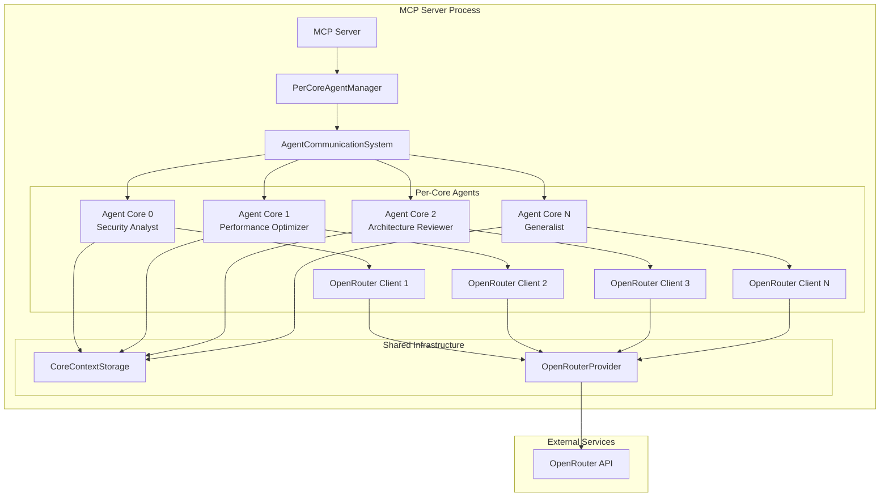

# Design Document

## Overview

This design implements per-CPU-core agent coordination where each available CPU core acts as an autonomous AI agent with its own OpenRouter API connection for independent thinking sessions. The system builds upon the existing multi-agent architecture in Nexus MCP, enhancing it with true per-core agent isolation and OpenRouter-based thinking capabilities.

The design leverages the existing `AgentCommunicationSystem`, `Agent`, and `AgentAPIClient` classes while adding a new `PerCoreAgentManager` that orchestrates agent creation, lifecycle management, and OpenRouter integration.

## Architecture

### High-Level Architecture



### Component Relationships

1. **PerCoreAgentManager**: Central coordinator that manages agent lifecycle
2. **AgentCommunicationSystem**: Existing system for inter-agent communication
3. **Agent**: Individual agent instances with role-specific personalities
4. **AgentAPIClient**: Enhanced to use OpenRouter exclusively for thinking sessions
5. **OpenRouterProvider**: Existing provider for OpenRouter API integration
6. **CoreContextStorage**: Existing per-core context isolation system

## Components and Interfaces

### PerCoreAgentManager

The central component responsible for agent lifecycle management and coordination.

```python
class PerCoreAgentManager:
    def __init__(self, openrouter_api_key: str, max_agents: Optional[int] = None)
    def initialize_agents() -> List[Agent]
    def shutdown_agents() -> None
    def get_agent_by_core(self, core_id: int) -> Optional[Agent]
    def get_agents_by_role(self, role: AgentRole) -> List[Agent]
    def redistribute_workload(self, failed_agent_id: str) -> None
    def get_system_health() -> Dict[str, Any]
```

**Key Responsibilities:**
- Detect available CPU cores using `os.cpu_count()` and `multiprocessing.cpu_count()`
- Create one agent per available core with appropriate role assignment
- Initialize OpenRouter API clients for each agent
- Monitor agent health and handle failures
- Coordinate graceful shutdown

### Enhanced AgentAPIClient

Extends the existing `AgentAPIClient` to use OpenRouter exclusively for thinking sessions.

```python
class AgentAPIClient:
    # Existing methods remain unchanged
    
    def configure_openrouter_only(self, api_key: str) -> None
    def make_thinking_session_call(self, prompt: str, thinking_mode: str = "high") -> AgentAPICall
    def get_openrouter_usage_stats() -> Dict[str, Any]
```

**Key Enhancements:**
- Force OpenRouter provider selection for all API calls
- Implement thinking-specific parameter optimization
- Add OpenRouter-specific rate limiting and error handling
- Track OpenRouter usage statistics per agent

### Agent Role Assignment Strategy

Agents are assigned roles based on core availability and system characteristics:

```python
def assign_agent_roles(self, num_cores: int) -> List[AgentRole]:
    """Assign roles to agents based on available cores"""
    
    # Priority order for role assignment
    role_priority = [
        AgentRole.SECURITY_ANALYST,      # Core 0 - Critical security analysis
        AgentRole.PERFORMANCE_OPTIMIZER, # Core 1 - Performance monitoring
        AgentRole.ARCHITECTURE_REVIEWER, # Core 2 - System design review
        AgentRole.CODE_QUALITY_INSPECTOR,# Core 3 - Code quality checks
        AgentRole.DEBUG_SPECIALIST,      # Core 4 - Debugging assistance
        AgentRole.PLANNING_COORDINATOR,  # Core 5 - Task coordination
        AgentRole.CONSENSUS_FACILITATOR, # Core 6 - Decision facilitation
        AgentRole.GENERALIST            # Core 7+ - General assistance
    ]
```

### OpenRouter Integration Strategy

Each agent gets its own OpenRouter configuration optimized for thinking sessions:

```python
@dataclass
class AgentOpenRouterConfig:
    api_key: str
    preferred_models: List[str]  # Role-specific model preferences
    rate_limit_per_minute: int = 60
    max_concurrent_calls: int = 3
    thinking_mode_default: str = "high"
    temperature_range: Tuple[float, float] = (0.3, 0.8)
```

**Model Selection Strategy:**
- Security Analyst: `["openai/o3", "anthropic/claude-3-opus"]`
- Performance Optimizer: `["google/gemini-pro", "openai/gpt-4-turbo"]`
- Architecture Reviewer: `["anthropic/claude-3-opus", "openai/o3"]`
- Generalist: `["google/gemini-flash", "openai/gpt-4o-mini"]`

## Data Models

### AgentThinkingSession

Represents a thinking session executed by an agent through OpenRouter:

```python
@dataclass
class AgentThinkingSession:
    session_id: str
    agent_id: str
    core_id: int
    thinking_prompt: str
    model_used: str
    thinking_mode: str
    started_at: float
    completed_at: Optional[float] = None
    result: Optional[str] = None
    error: Optional[str] = None
    openrouter_usage: Dict[str, int] = field(default_factory=dict)
    
    def get_duration(self) -> float
    def is_completed(self) -> bool
    def to_dict(self) -> Dict[str, Any]
```

### PerCoreAgentStatus

Tracks the status and health of each per-core agent:

```python
@dataclass
class PerCoreAgentStatus:
    agent_id: str
    core_id: int
    role: AgentRole
    status: AgentStatus
    openrouter_connected: bool
    active_thinking_sessions: int
    total_api_calls: int
    success_rate: float
    last_activity: float
    memory_usage_mb: float
    
    def is_healthy(self) -> bool
    def needs_attention(self) -> bool
    def to_dict(self) -> Dict[str, Any]
```

## Error Handling

### Agent Failure Recovery

```python
class AgentFailureHandler:
    def handle_agent_failure(self, agent_id: str, error: Exception) -> None:
        """Handle agent failure with automatic recovery"""
        
        # 1. Log failure details
        # 2. Attempt to restart agent on same core
        # 3. If restart fails, redistribute workload to healthy agents
        # 4. Update system health status
        # 5. Notify monitoring systems
```

### OpenRouter API Error Handling

```python
class OpenRouterErrorHandler:
    def handle_api_error(self, agent_id: str, error: Exception) -> AgentAPICall:
        """Handle OpenRouter API errors with fallback strategies"""
        
        # 1. Rate limit errors: Implement exponential backoff
        # 2. Authentication errors: Validate API key and retry
        # 3. Model unavailable: Switch to fallback model
        # 4. Network errors: Retry with circuit breaker pattern
        # 5. Quota exceeded: Distribute load to other agents
```

### Graceful Degradation

When agents fail or OpenRouter is unavailable:

1. **Single Agent Failure**: Redistribute workload to healthy agents
2. **Multiple Agent Failures**: Fall back to single-agent mode
3. **OpenRouter Unavailable**: Use alternative providers with reduced functionality
4. **Complete System Failure**: Graceful shutdown with state preservation

## Testing Strategy

### Unit Tests

```python
class TestPerCoreAgentManager:
    def test_agent_creation_per_core()
    def test_openrouter_configuration()
    def test_role_assignment_strategy()
    def test_agent_failure_recovery()
    def test_graceful_shutdown()

class TestAgentThinkingSessions:
    def test_thinking_session_creation()
    def test_openrouter_api_integration()
    def test_concurrent_thinking_sessions()
    def test_session_timeout_handling()
    def test_result_aggregation()
```

### Integration Tests

```python
class TestPerCoreAgentIntegration:
    def test_full_system_initialization()
    def test_multi_agent_coordination()
    def test_openrouter_load_balancing()
    def test_system_health_monitoring()
    def test_end_to_end_thinking_workflow()
```

### Performance Tests

```python
class TestPerCoreAgentPerformance:
    def test_agent_startup_time()
    def test_concurrent_api_call_throughput()
    def test_memory_usage_per_agent()
    def test_cpu_utilization_efficiency()
    def test_openrouter_rate_limit_handling()
```

### Simulation Tests

```python
class TestAgentBehaviorSimulation:
    def test_agent_thinking_patterns()
    def test_inter_agent_communication()
    def test_role_specific_decision_making()
    def test_collaborative_problem_solving()
    def test_system_resilience_under_load()
```

## Implementation Phases

### Phase 1: Core Infrastructure
- Implement `PerCoreAgentManager` with basic agent creation
- Enhance `AgentAPIClient` for OpenRouter-only operation
- Add CPU core detection and agent role assignment
- Basic health monitoring and status reporting

### Phase 2: OpenRouter Integration
- Configure OpenRouter API clients per agent
- Implement thinking session management
- Add role-specific model selection
- Implement basic error handling and retries

### Phase 3: Advanced Coordination
- Implement inter-agent communication for thinking sessions
- Add synchronized thinking capabilities
- Implement workload redistribution on failures
- Add comprehensive monitoring and metrics

### Phase 4: Optimization and Resilience
- Implement advanced error handling and recovery
- Add performance optimization features
- Implement graceful degradation strategies
- Add comprehensive testing and validation

## Security Considerations

### API Key Management
- Store OpenRouter API keys securely using environment variables
- Implement key rotation capabilities
- Add API key validation and health checks
- Monitor for unauthorized usage patterns

### Agent Isolation
- Ensure agents cannot access each other's API keys
- Implement proper memory isolation between agents
- Add audit logging for all agent activities
- Implement rate limiting per agent to prevent abuse

### Communication Security
- Encrypt inter-agent communication if sensitive data is involved
- Implement authentication for agent-to-agent messages
- Add message integrity verification
- Monitor for suspicious communication patterns

## Monitoring and Observability

### Metrics Collection
```python
class PerCoreAgentMetrics:
    # Agent-level metrics
    agent_health_status: Dict[str, bool]
    api_calls_per_agent: Dict[str, int]
    thinking_sessions_active: Dict[str, int]
    
    # System-level metrics
    total_agents_active: int
    openrouter_api_usage: Dict[str, int]
    system_cpu_utilization: float
    memory_usage_per_core: Dict[int, float]
    
    # Performance metrics
    average_thinking_session_duration: float
    api_call_success_rate: float
    inter_agent_communication_latency: float
```

### Health Checks
- Agent responsiveness monitoring
- OpenRouter API connectivity checks
- Memory and CPU usage monitoring
- Inter-agent communication health
- System-wide performance metrics

### Alerting
- Agent failure notifications
- OpenRouter API quota warnings
- Performance degradation alerts
- System resource exhaustion warnings
- Security anomaly detection